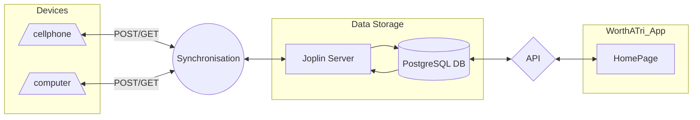

# WorthATri
Description: App to assist with training for a triathlon
Data flow: **will need github + mermaid chrome extension: https://chrome.google.com/webstore/detail/github-%20-mermaid/goiiopgdnkogdbjmncgedmgpoajilohe

WorthATri will be an app that I synchronise with the note taking software Joplin.  Joplin allows for synchronisation to multiple cloud based devices. The goal here will be to setup a way for me to create tasks, send either notifications or text messages when I should be doing a task, assist in logging food, and ultimately any other thing that I think would help take a load off my mind while I train my mind and body

V.01 
Joplin Tasks. Make a way to create tasks in Joplin, synchronise to cloud, and display on a simple C# web app

Next Step: Create crud functionality so that I can better organize what I have done on the app. Possibly a little drag and drop action? I'm thinking that the user can create buckets, then tasks that are synched all show up on the same page, and you can drag and drop the task in the appropriate bucket (makes it fun, and very satisfying)

